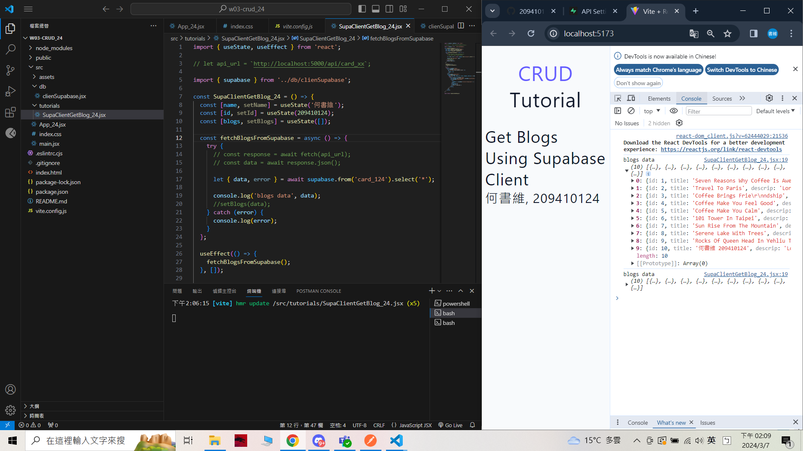
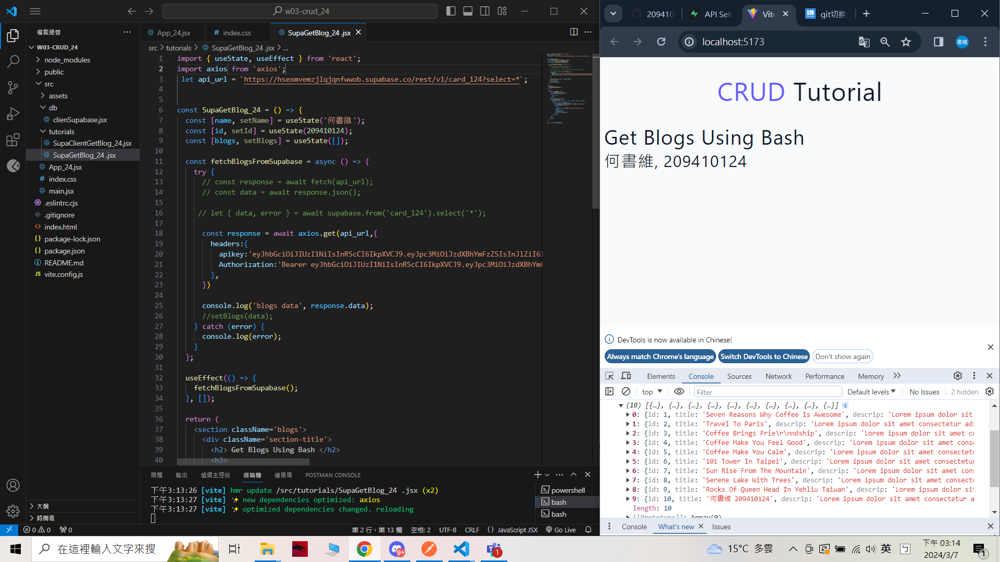
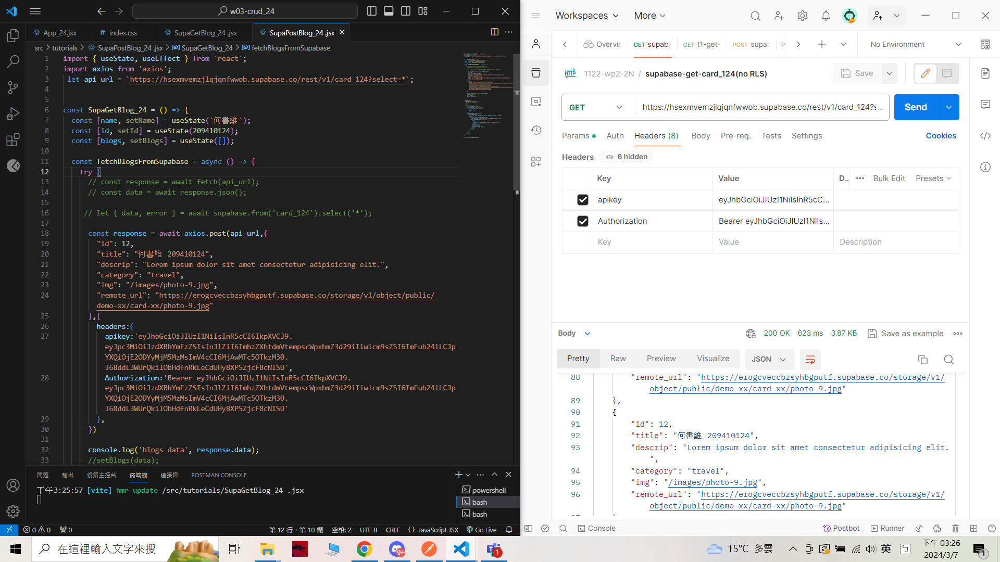
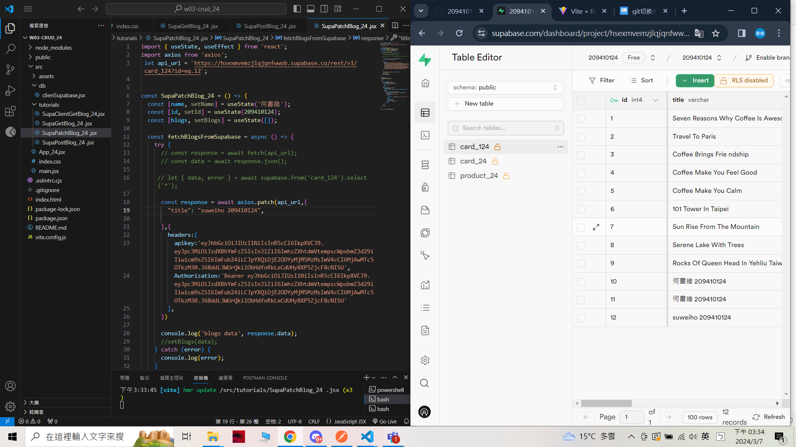
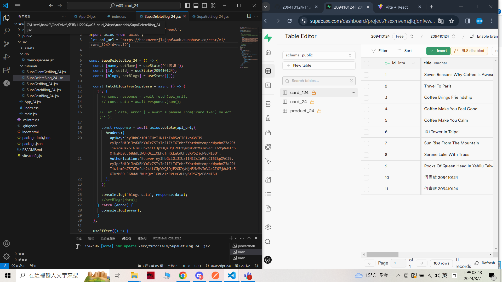

[My Github URL](https://github.com/209410124/1122-wp2-2N-24.git)

git log --pretty=format:"%h%x09%an%x09%ad%x09%s" --after="2024-03-06"

### W3-P1: Use SupaClientGetBlog_xx.jsx (supabase client) to get card_24 data
 


```
eee371b unknown Thu Mar 7 14:25:38 2024 +0800   W3-P1: Use SupaClientGetBlog_24.jsx (supabase client) to get card_24 data
```
### W3-P2: Use SupaGetBlog_24.jsx to get card_24 data
 

```
0b18cc1 unknown Thu Mar 7 15:16:22 2024 +0800   W3-P2: Use SupaGetBlog_24.jsx to get card_24 data
```

### W3-P3: Use SupaPostBlog_24.jsx to add blog data
 

 ```
 2204a70 unknown Thu Mar 7 15:27:27 2024 +0800   W3-P3: Use SupaPostBlog_24.jsx to add blog data
 ```
 ### W3-P4: Use SupaPatchBlog_24.jsx to modify blog data
 

```
2e15ba6 unknown Thu Mar 7 15:36:41 2024 +0800   W3-P4: Use SupaPatchBlog_24.jsx to modify 
blog data
```

### W3-P5: Use SupaDeleteBlog_24.jsx to delete blog data
 

