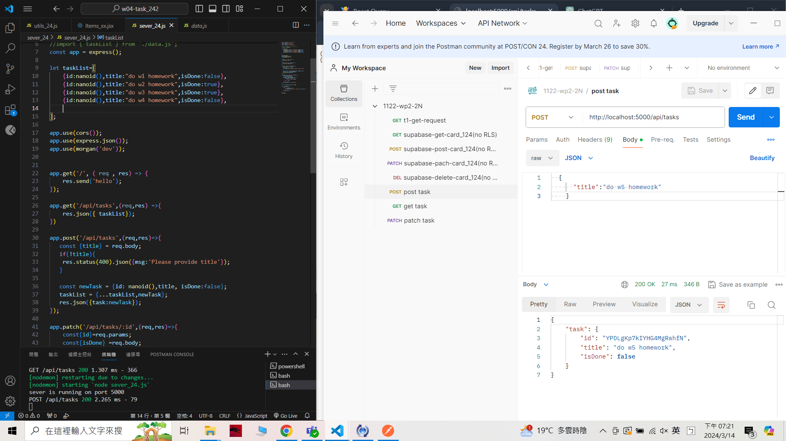

[My Github URL](https://github.com/209410124/1122-wp2-2N-24.git)

git log --pretty=format:"%h%x09%an%x09%ad%x09%s" --after="2024-03-13"

### W4-P1: Server: implement GET /api/tasks
 


```
a9791da unknown Thu Mar 14 15:44:09 2024 +0800  W4-P1: Server: implement GET /api/tasks
```

### W4-P2: Server: implement POST /api/tasks
 


```
602f9cb unknown Thu Mar 14 18:26:34 2024 +0800  W4-P2: Server: implement POST /api/tasks
```

### W4-P3: Server: implement PATCH /api/tasks/:id
 


```
c564bb9 unknown Thu Mar 14 19:22:09 2024 +0800  W4-P3: Server: implement PATCH /api/tasks/:id
```
### all log
```
c564bb9 unknown Thu Mar 14 19:22:09 2024 +0800  W4-P3: Server: implement PATCH /api/tasks/:id
602f9cb unknown Thu Mar 14 18:26:34 2024 +0800  W4-P2: Server: implement POST /api/tasks  
a9791da unknown Thu Mar 14 15:44:09 2024 +0800  W4-P1: Server: implement GET /api/tasks
```