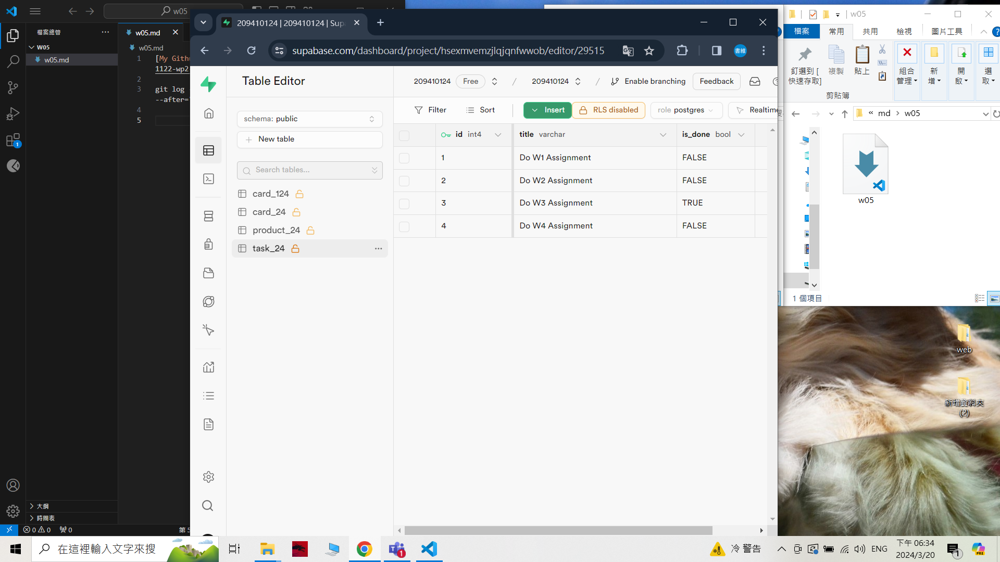

[My Github URL](https://github.com/209410124/1122-wp2-2N-24.git)

git log --pretty=format:"%h%x09%an%x09%ad%x09%s" --after="2024-03-19"

### W5-P1 Create task_24 table in Supabase with 4 data using SQL
 
