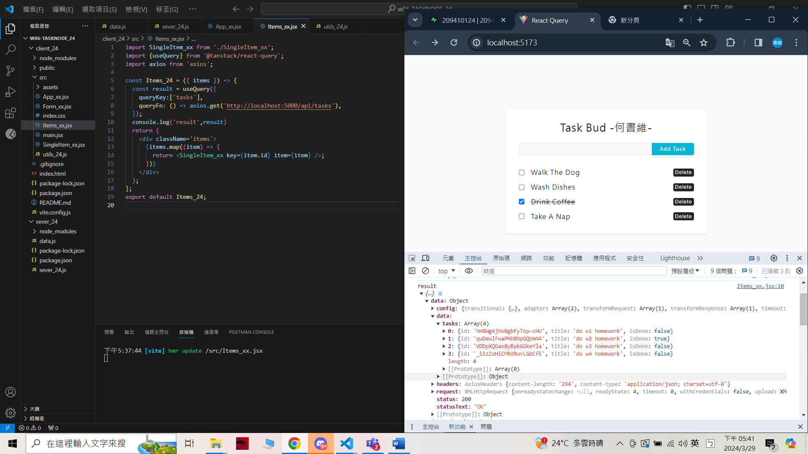
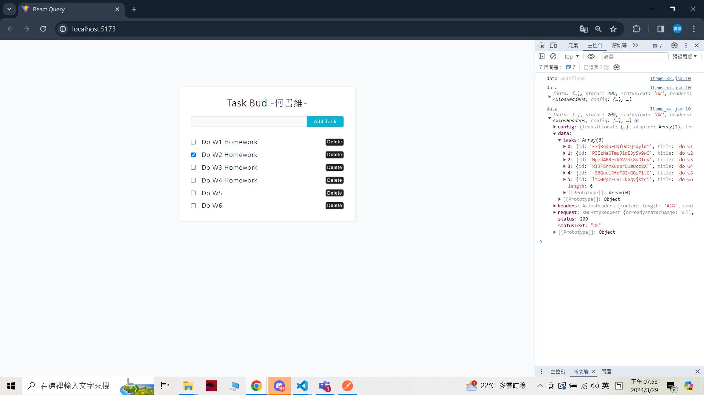

[My Github URL](https://github.com/209410124/1122-wp2-2N-24.git)

git log --pretty=format:"%h%x09%an%x09%ad%x09%s" --after="2024-03-28"

### W6-P1: Update a task in Supabase
 

 ```
 063f572 unknown Fri Mar 29 17:12:42 2024 +0800  W6-P1: Update a task in Supabase
 ```

 ### W6-P2: Delete a task in Supabase
 
#### => local
 

 
#### => Vercel: insert a task, edit the task, delete the task
 


```
1039e72 unknown Fri Mar 29 18:09:55 2024 +0800  W6-P2: Delete a task in Supabase
```
### W6-P3: Get all tasks from node server
 

 

 ```
 11eac0a unknown Fri Mar 29 18:27:30 2024 +0800  W6-P3: Get all tasks from node server
 ```

 ### W6-P4: Insert a task into node server
 


### W6-P5: Git logs of W6