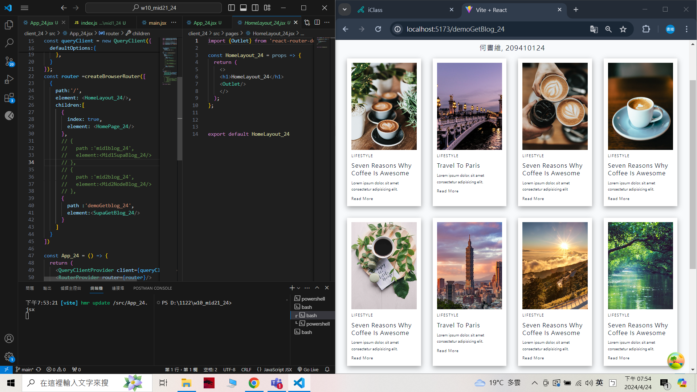
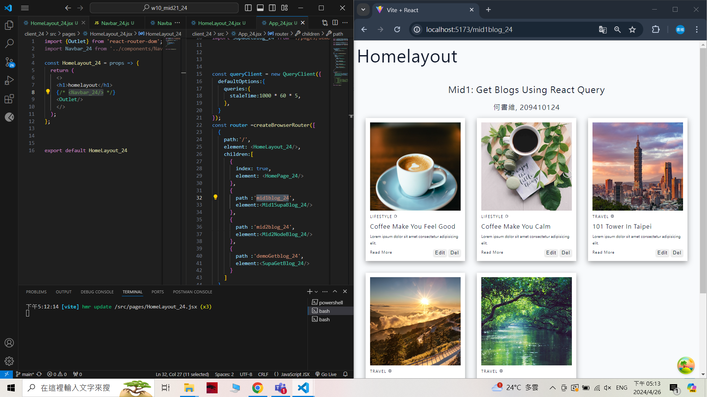
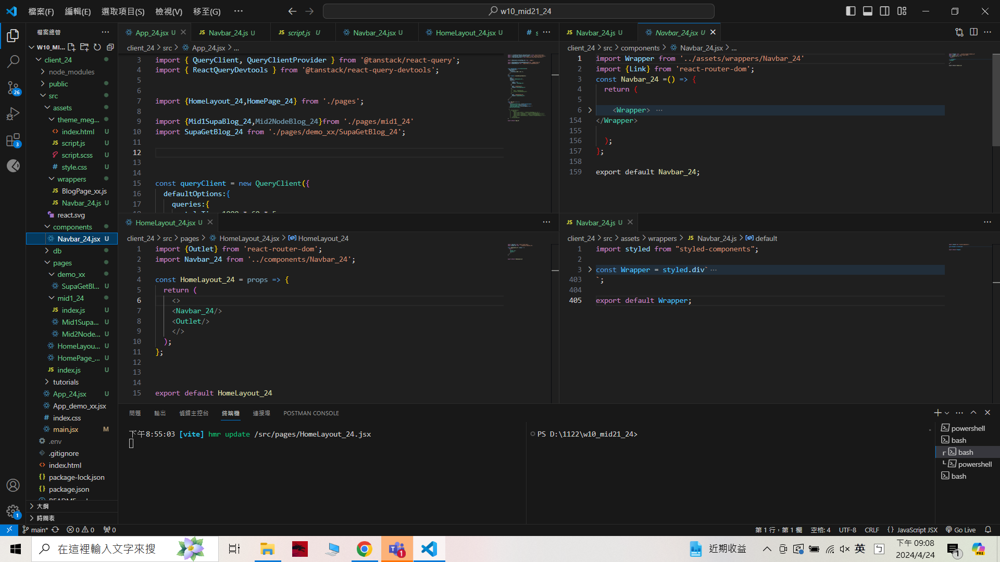
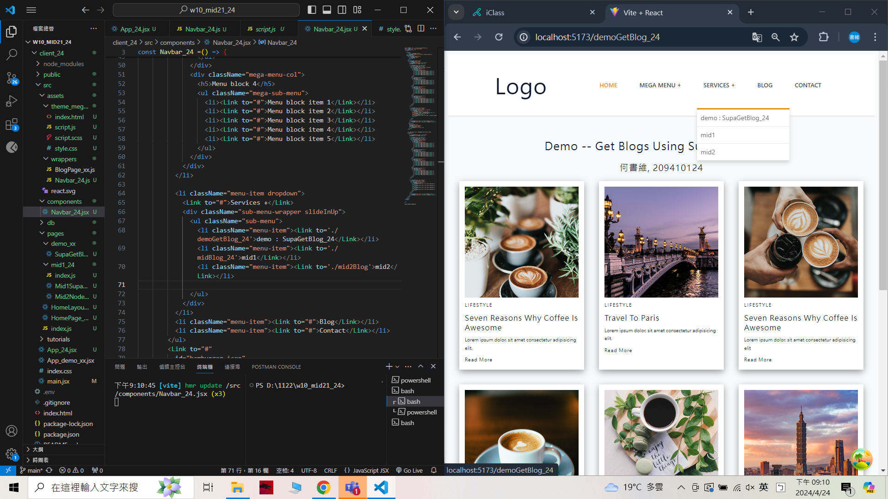
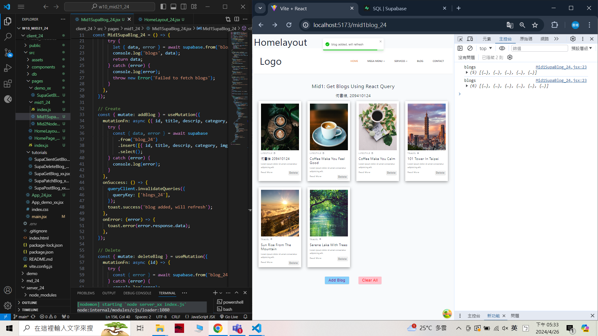
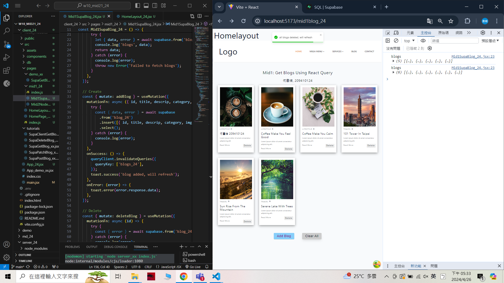

[My Github URL](https://github.com/209410124/1122-wp2-2N-24.git)

git log --pretty=format:"%h%x09%an%x09%ad%x09%s" --after="2024-04-25"

### W10-P1: Create HomeLayout_24 for all routes
 

 


```
6aa5584 unknown Fri Apr 26 17:35:54 2024 +0800  ### W10-P1: Create HomeLayout_24 for all routes
```

###　W10-P2: Add Navbar_24 with 3 menu items
 

 

 
### W10-P3: Get all blogs using route /mid1Blog_24 (自行完成)
 

 
