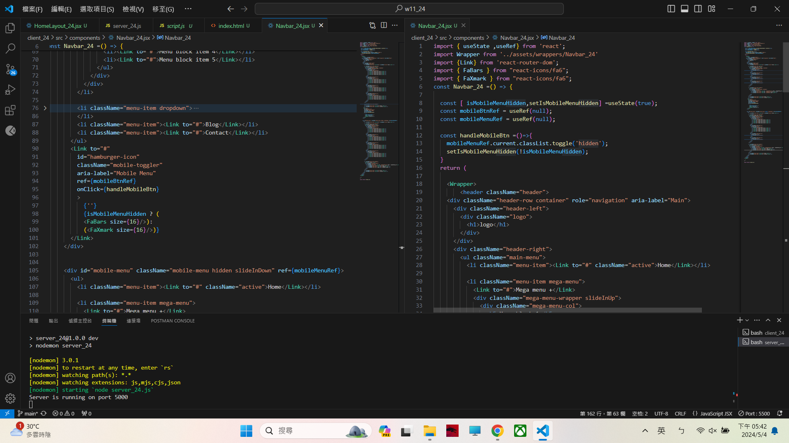

[My Github URL](https://github.com/209410124/1122-wp2-2N-24.git)

git log --pretty=format:"%h%x09%an%x09%ad%x09%s" --after="2024-05-3"

### W11-P1: Make mobileBtn work correctly
 

 


 ```
 391a938 unknown Sat May 4 17:46:14 2024 +0800   W11-P1: Make mobileBtn work correctly
 ```

 ### W11-P2: Use Postman to test GET /api/blogs, and DELETE /api/blogs/:id
 

 


```
d8d6235 unknown Sat May 4 18:13:54 2024 +0800   W11-P2: Use Postman to test GET /api/blogs, and DELETE /api/blogs/:id
```

### W11-P3: Use Postman to test DELETE /api/blogs/clearAll, and POST /api/blogs/loadAll
 
#### => test DELETE /api/blogs/clearAll
 

 
#### => test POST /api/blogs/loadAll
 


```
fa49360 unknown Sat May 4 18:22:13 2024 +0800   ### W11-P3: Use Postman to test DELETE /api/blogs/clearAll, and POST /api/blogs/loadAll
```
### W11-P4: Git logs of W11
```
fa49360 unknown Sat May 4 18:22:13 2024 +0800   ### W11-P3: Use Postman to test DELETE /api/blogs/clearAll, and POST /api/blogs/loadAll
d8d6235 unknown Sat May 4 18:13:54 2024 +0800   W11-P2: Use Postman to test GET /api/blogs, and DELETE /api/blogs/:id
391a938 unknown Sat May 4 17:46:14 2024 +0800   W11-P1: Make mobileBtn work correctly
```