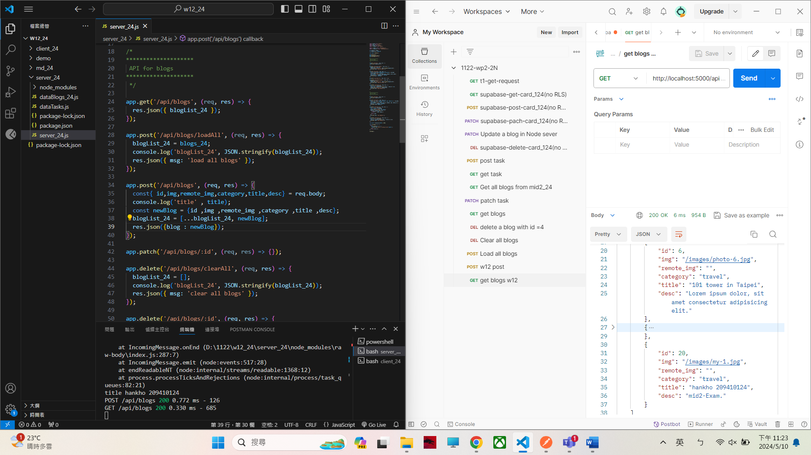
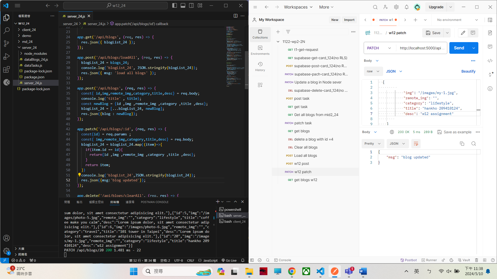
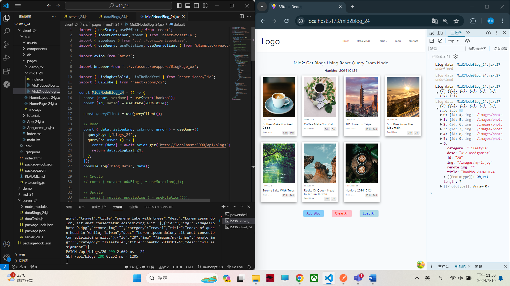
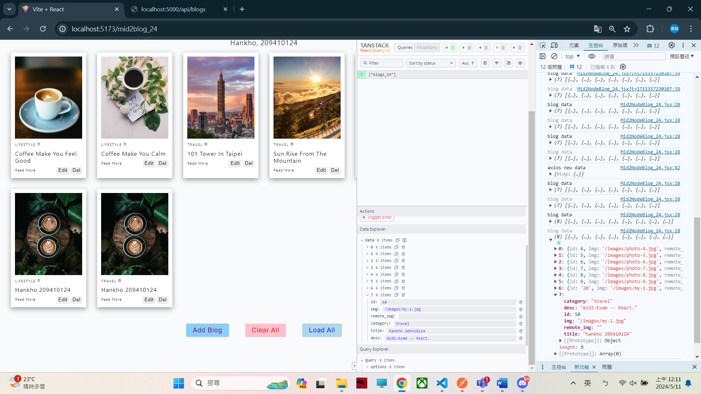
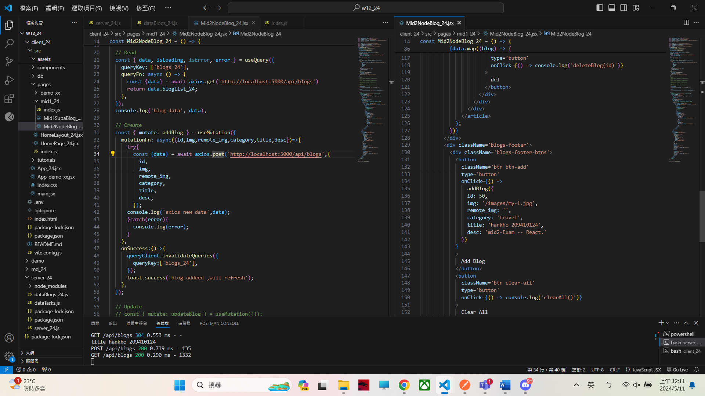

[My Github URL](https://github.com/209410124/1122-wp2-2N-24.git)

git log --pretty=format:"%h%x09%an%x09%ad%x09%s" --after="2024-05-9"

### W12-P1: Insert a blog using local json array
 

 
 
```
8b154af unknown Fri May 10 23:39:32 2024 +0800  ### W12-P1: Insert a blog using local json array
```

### W12-P2: Update a blog with id=20
 

 
```
18020be unknown Fri May 10 23:41:43 2024 +0800  ### W12-P2: Update a blog with id=20
```

### W12-P3: Use React Query to read all blogs from Node server
 

 
```
341017c unknown Sat May 11 00:13:01 2024 +0800  ### W12-P3: Use React Query to read all blogs from Node server
```

### W12-P4: Insert a blog using React Query
 

 

 
```
4579bad htchung Wed May 8 21:16:31 2024 +0800   W12-P4: Insert a blog using React Query
```