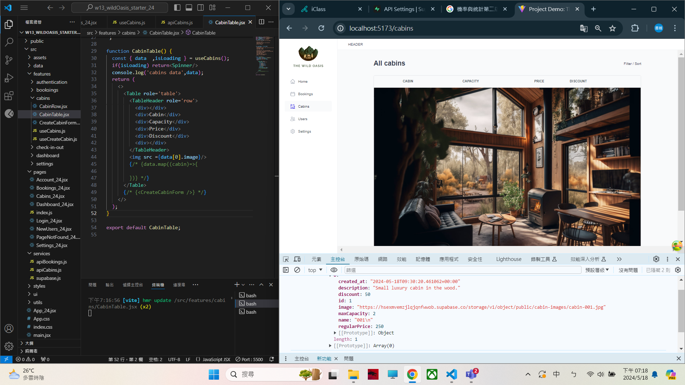

[My Github URL](https://github.com/209410124/1122-wp2-2N-24.git)

git log --pretty=format:"%h%x09%an%x09%ad%x09%s" --after="2024-05-17"

### W13-P1: Get first Cabins_xx data from Supabase
 

 
```
22d5e74 htchung Wed May 15 20:22:36 2024 +0800  W13-P1: Get first Cabins_xx data from Supabase
```


 

 
