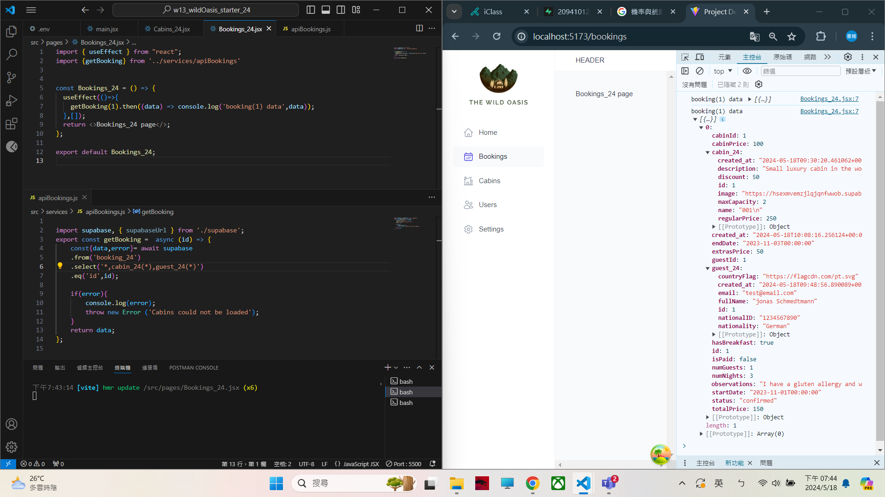

[My Github URL](https://github.com/209410124/1122-wp2-2N-24.git)

git log --pretty=format:"%h%x09%an%x09%ad%x09%s" --after="2024-05-17"

### W13-P1: Get first Cabins_24 data from Supabase
 

 
```
3c4a955 unknown Sat May 18 19:45:45 2024 +0800  ### W13-P1: Get first Cabins_24 data from Supabase
```

### W13-P2: Get first booking_24 data, with corresponding cabin_24 and guest_24 data
 

 
```
ce17c74 unknown Sat May 18 19:47:59 2024 +0800  ### W13-P2: Get first booking_24 data, with corresponding cabin_24 and guest_24 data
```
 

### W13-P3: Git logs of W13
 
```
git log --pretty=format:"%h%x09%an%x09%ad%x09%s" --after="2024-05-17"
 
 ce17c74 unknown Sat May 18 19:47:59 2024 +0800  ### W13-P2: Get first booking_24 data, with corresponding cabin_24 and guest_24 data
3c4a955 unknown Sat May 18 19:45:45 2024 +0800  ### W13-P1: Get first Cabins_xx data from Supabase

```
