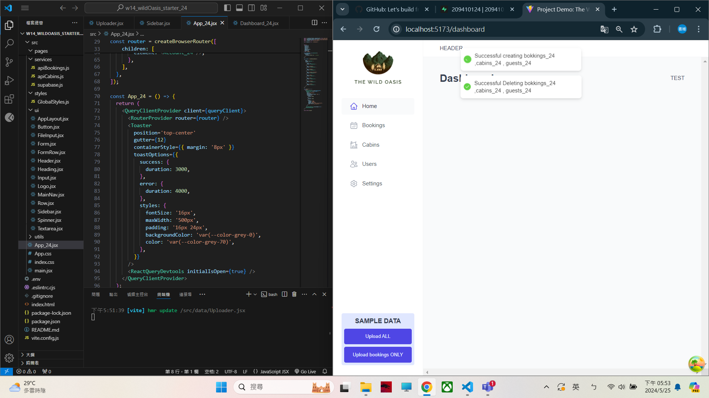
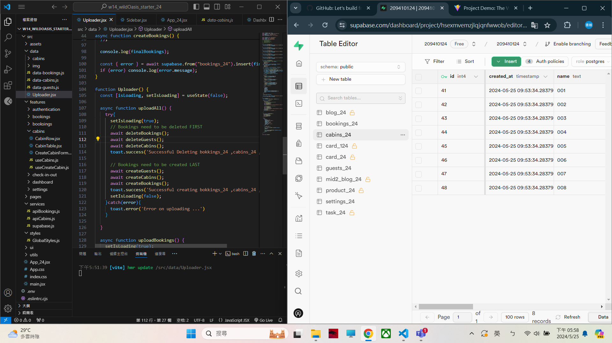
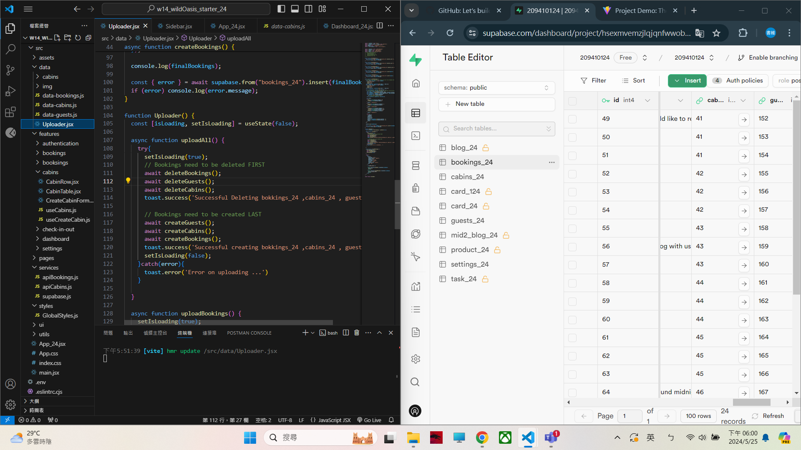
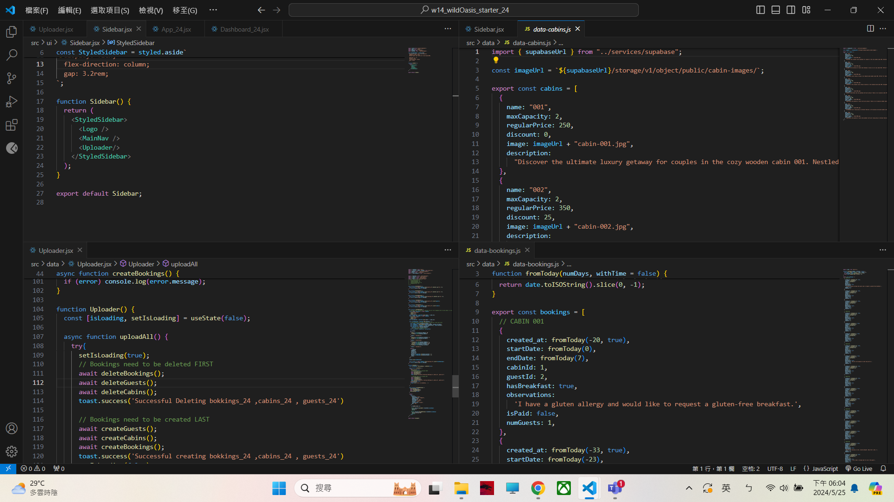
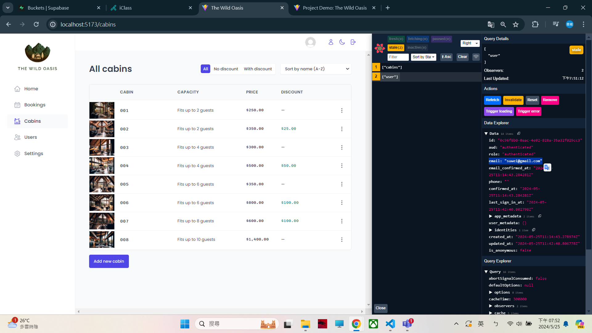
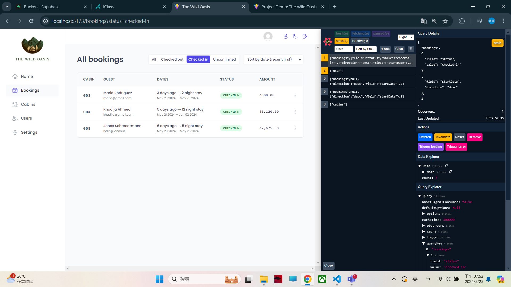
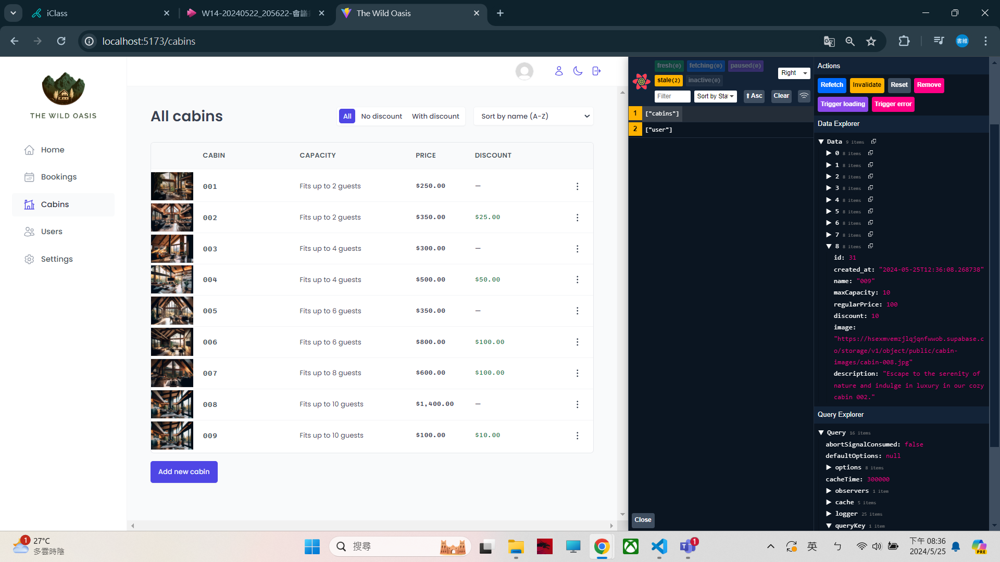

[My Github URL](https://github.com/209410124/1122-wp2-2N-24.git)

git log --pretty=format:"%h%x09%an%x09%ad%x09%s" --after="2024-05-24"

###  W14-P1: Use sql to create schemas of cabins_24, guests_24, bookings_24, settings_24, and use Uploader to upload all data

 

 

 


```
ba51746 unknown Sat May 25 18:07:09 2024 +0800  W14-P1: Use sql to create schemas of cabins_24, guests_24, bookings_24, settings_24, and use Uploader to upload all data
```
### W14-P2: Make jonas code work, and show cabins and bookings info
 

 




```
31a3772 unknown Sat May 25 19:58:51 2024 +0800  W14-P2: Make jonas code work, and show cabins and bookings info
```