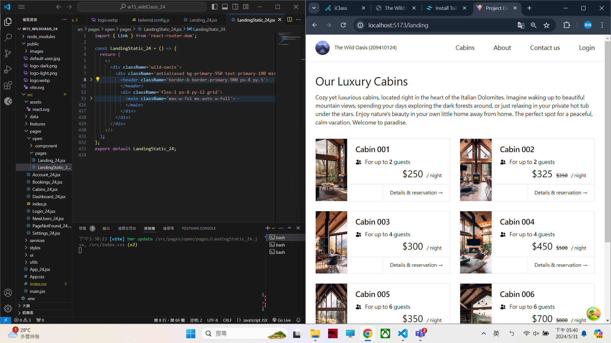
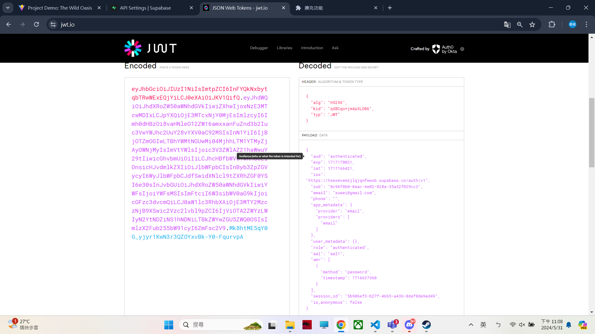
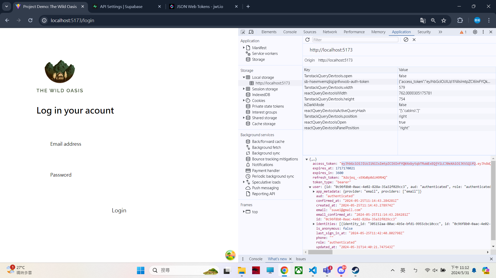
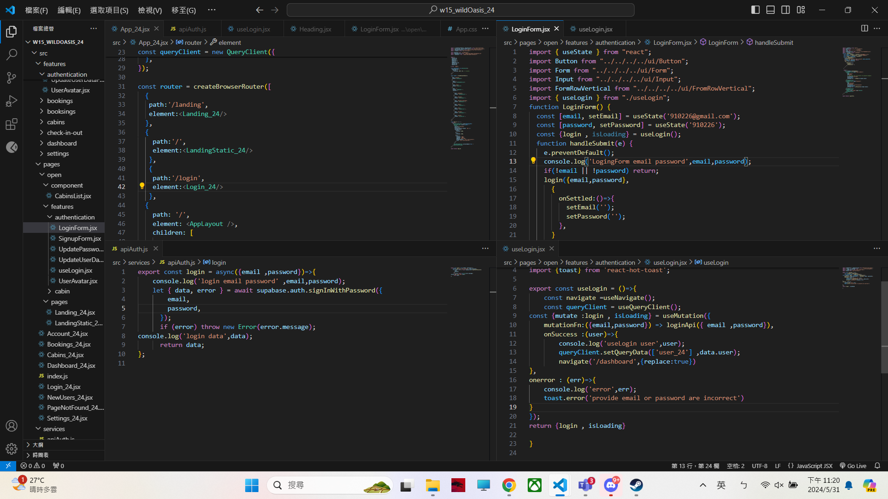

[My Github URL](https://github.com/209410124/1122-wp2-2N-24.git)

git log --pretty=format:"%h%x09%an%x09%ad%x09%s" --after="2024-05-30"

### W15-P1: Show static page <LandingStatic_24 /> using route /landing
 


```
069e545 unknown Fri May 31 18:14:10 2024 +0800  W15-P1: Show static page <LandingStatic_24 /> using route /landing  
```

### W15-P2: For landing page, get 8 cabins data from Supabase
 


```
1897ea5 unknown Fri May 31 20:53:40 2024 +0800   W15-P2: For landing page, get 8 cabins data from Supabase
```

### W15-P3: Implement login using LoginForm, useLogin, login (apiAuth.jsx), navigate to /dashboard when successful#### => login in with email (has your id), password


#### => go to jwt.io to check the jwt token with email same as above


#### => code using App_xx.jsx, LoginForm.jsx, useLogin.jsx, apiAuth.js with console.log message shown in w15-p3-4.png


#### => show console.log messages, also, with React Query DevTools
