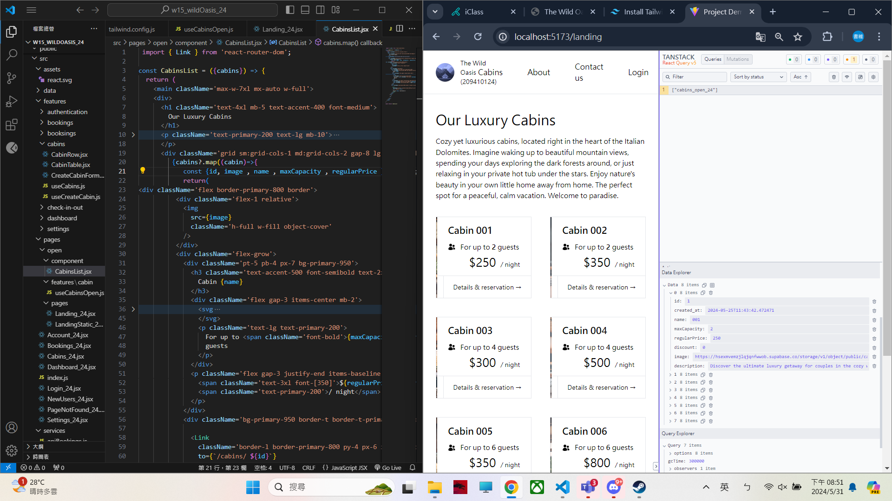

[My Github URL](https://github.com/209410124/1122-wp2-2N-24.git)

git log --pretty=format:"%h%x09%an%x09%ad%x09%s" --after="2024-05-30"

### W15-P1: Show static page <LandingStatic_24 /> using route /landing
 


```
069e545 unknown Fri May 31 18:14:10 2024 +0800  W15-P1: Show static page <LandingStatic_24 /> using route /landing  
```

### W15-P2: For landing page, get 8 cabins data from Supabase
 
